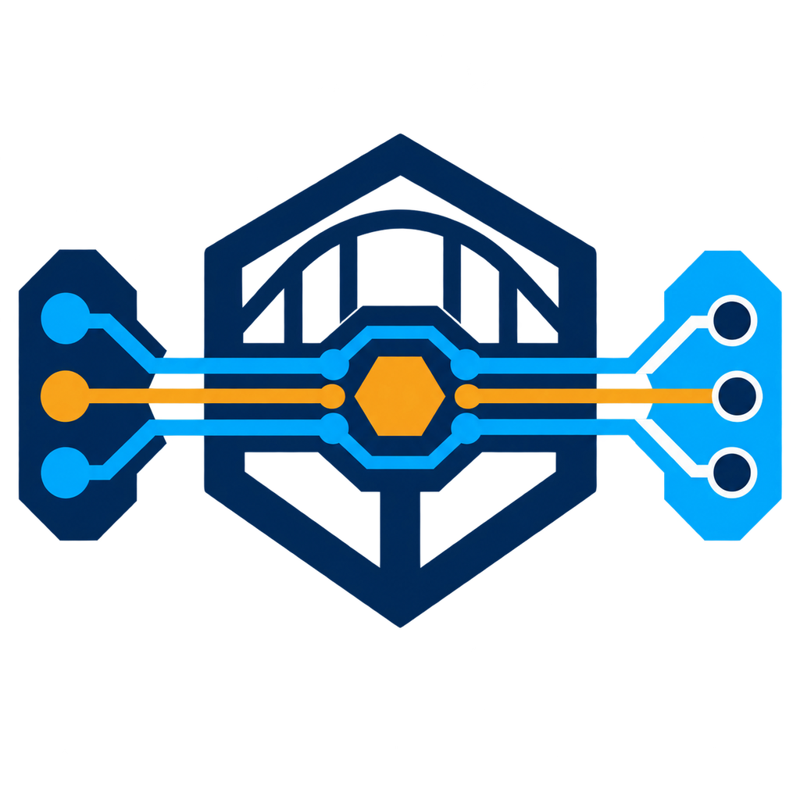
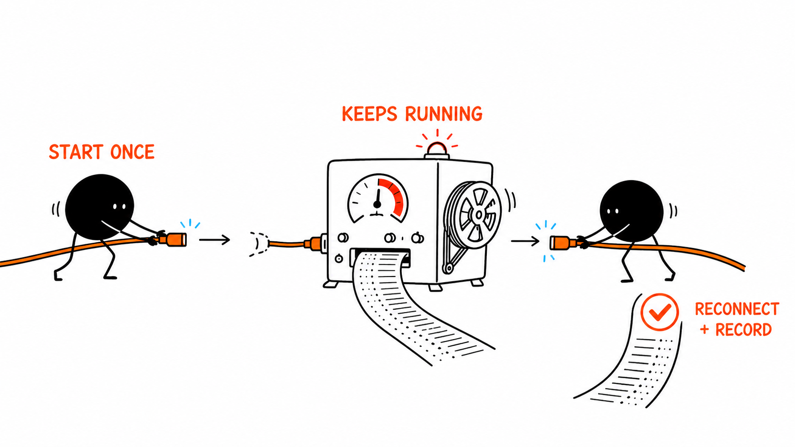

# EDA Bridge Runtime

<p align="center">
  
</p>

<p align="center"><strong>Keep EDA work reliable whether the Agent runs beside the tool or reaches it over SSH.</strong></p>

`eda-bridge-runtime` is an agent-neutral execution layer for EDA automation.
It gives local and SSH-driven bridges the same request envelope, durable job
semantics, context handoff, timing evidence, and append-only execution ledger.

The runtime is intentionally not an EDA bridge and not an AI harness. Vendor
bridges keep their native API knowledge. Agents state a short purpose; the
runtime records what was requested, what actually ran, how long each phase
took, and what result or artifact was produced.



## What changes for the user

You state the task and intended target once. The Runtime carries the same
request through a local or remote path, keeps long work recoverable across a
disconnect, and returns the result with its linked timing and evidence.
When a known read result is much larger than the few facts needed, a deterministic
result view can select those values or counts before the full inventory enters the
Agent context. Full responses remain the default for exploration.

On any host where Codex acts as the Agent, create or refresh its isolated EDA profile directly from
the installed Runtime package:

```text
eda-runtime agent-profile codex install
```

No source checkout is required. The generated profile keeps the Runtime path and selected EDA
Skills while excluding inherited general-purpose execution tools only from that profile.

## Design promises

- Local and SSH execution use one protocol and one evidence model.
- Every agent-originated operation carries a concise `purpose`.
- Actor metadata is collected automatically where possible and records its
  provenance; missing metadata never blocks engineering work.
- Mutating requests are idempotent and auditable.
- Disconnection does not imply that a long EDA job failed.
- Context tokens contain locators and fingerprints, never credentials.
- EDA-specific behavior lives in adapters, not in the runtime core.

## Current alpha

`0.1.0a25` retains Codex's internal MCP host while keeping Agent-visible Code Mode and shell tools
disabled. This corrects the packaged alpha.24 profile on Codex 0.151 without reopening an alternate
execution path.

`0.1.0a24` packages the isolated Codex EDA profile installer, so the same one-command setup works on
local and remote Agent hosts without a source checkout. It also makes Codex evaluation fail closed
on shell and other non-MCP actions, and adds ambiguity guards that require one blocking question
before an underspecified ADS or AnsysEM mutation.

`0.1.0a23` makes plan-step field boundaries machine-visible: vendor payload cannot silently absorb
Runtime wait or audit controls, and bounded solver evaluations require an approval independent of
disposable mutation approval. The authenticated Codex/Pi ladder now reaches idempotent mutation,
complete vendor lifecycles, a real generated-input Momentum solve, and one-turn cross-EDA
coordination without inventing a cross-vendor transaction.

`0.1.0a22` gives every MCP client lifecycle an automatic anonymous audit correlation when the Agent
cannot declare its own session, and reports only paired timing partitions while identifying legacy
measurements that cannot be compared. Generated Codex EDA profiles now explicitly isolate built-in
system Skills as well as unrelated installed Skills.

`0.1.0a20` keeps missing read-only safety discovery mechanical and makes optional result projection
explicitly opt-in only after its response paths are known, so Agents do not turn a successful EDA
read into a failed guessed projection. The evaluation client also constrains each case to its
declared Runtime tools and machine-readable final shape.

`0.1.0a19` made missing read-only safety discovery a mechanical Runtime preflight, so an Agent can
perform a safe typed read in one call without a separate capability turn. `0.1.0a18` lets one typed read or submission optionally wait for its durable terminal result in
the same Agent call, removing a second status-versus-wait decision without changing Bridge job
semantics. `0.1.0a17` carries the same bounded result views through durable waits and read-only plan steps,
while rejecting result projection on mutations before any change begins.
`0.1.0a16` adds deterministic bounded views for known large read results, preserving the normal
Run evidence while sending only selected values, counts, or existence facts into Agent context.
It also makes audit analysis use complete Runtime-observed calls instead of raw event windows.
`0.1.0a15` makes routine audit retrieval compact while retaining explicit forensic expansion, and
hardens bounded Windows transport shutdown when `taskkill` cannot finish the descendant tree.
`0.1.0a14` kept generated Codex profiles narrow when several cached releases expose the same
Skill: one canonical source is enabled and retained older copies are explicitly disabled.
`0.1.0a13` added one-call validated execution plans for short deterministic EDA sequences. Runtime
prevalidates target-specific capabilities and unique mutation identities before the first change,
waits for durable dependencies internally, stops on failure, and retains each step's purpose, Run,
timing, and audit link. Codex and Pi expose the same operation; single operations still use the
smaller direct tools.
Every MCP client contributes its
observed client identity, concise purpose, argument fingerprint, timings, and linked Run without
depending on a Codex- or Pi-specific hook. Agent hooks may add richer model/session metadata, but
they are optional enrichment. Agent adapters may attach bounded provider, model, reasoning,
session, and tool-call metadata; Runtime labels these values `declared`, while MCP client identity
remains independently `observed`. If no Agent session is declared, Runtime adds a non-identifying
`inferred` correlation ID for the current MCP client lifecycle without another Agent action. A
bounded `eda.connection.reset` action closes only a stale
Runtime-owned transport after an upgrade; it never closes or modifies the EDA application.

`0.1.0a5` added optional Codex lifecycle enrichment for session, turn, model, permission mode, and
tool-call identity. The append-only audit stores neither raw operation payloads nor chat transcripts.
Audit retrieval is context-bounded: `audit analyze` returns aggregate waste signals, `audit list`
returns compact call rows, and only explicit `audit list --full` expands forensic events.

`0.1.0a4` adds rich bounded Context snapshots, stable origin routing, direct
one-submit execution, and automatic origin binding during connection setup.
Vendor Skills can declare the Runtime MCP directly, so users select one
task-facing Skill rather than manually composing infrastructure Skills.

```powershell
python -m pip install "eda-bridge-runtime==0.1.0a25"
eda-runtime doctor
```

For repository development, create a virtual environment and install `.[dev]`
instead. Public releases are built once on a clean GitHub runner, published
through PyPI Trusted Publishing, and installed back from PyPI before acceptance.

See [Architecture](docs/ARCHITECTURE.md) and the
[protocol schema](docs/schemas/request-v1.schema.json). Host placement is
defined by the [agent-client, eda-worker, and combined deployment roles](docs/DEPLOYMENT_ROLES.md).

The lightweight Pi Agent pilot and its checked-in thin adapter are described in
[Pi Agent pilot](docs/PI_AGENT_PILOT.md). They reuse the same Runtime boundary instead of adding a
second SSH or EDA-control path.

The repository also includes a minimal [MCP and Codex plugin](docs/MCP_AND_CODEX.md). It resolves
named local/SSH connections without asking the agent to assemble transport commands on each call.
Sanitized real-host evidence is recorded in [acceptance results](docs/ACCEPTANCE.md).
