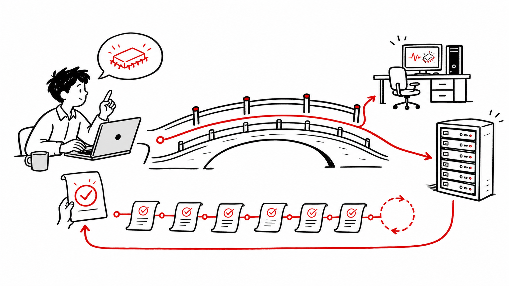
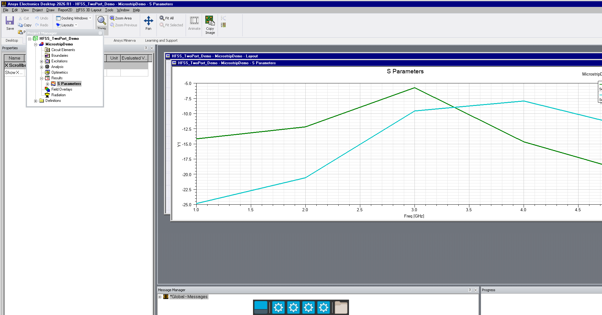
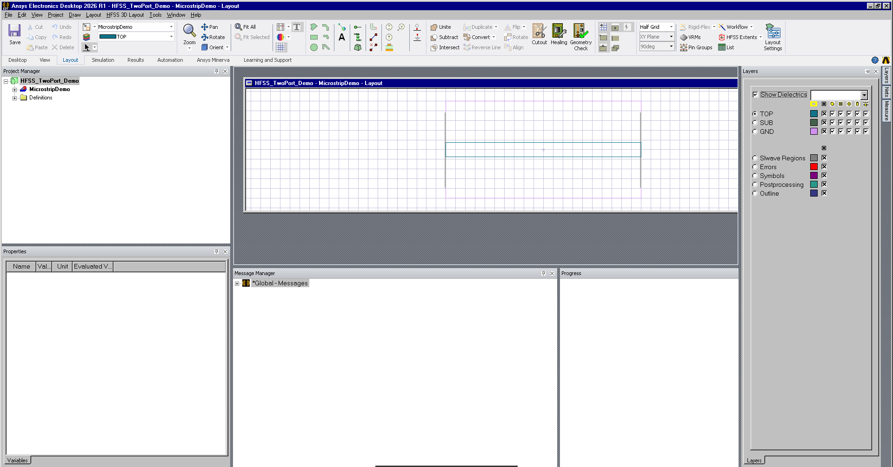
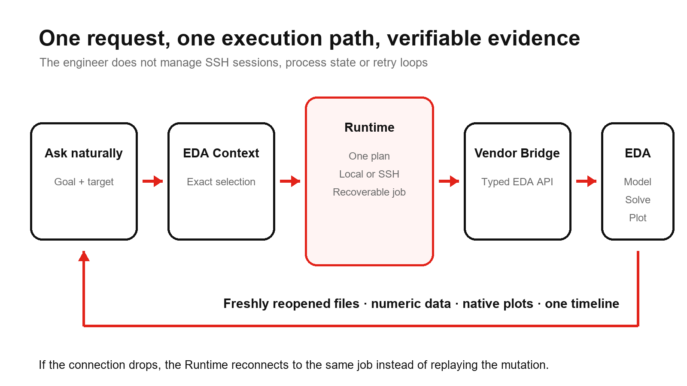
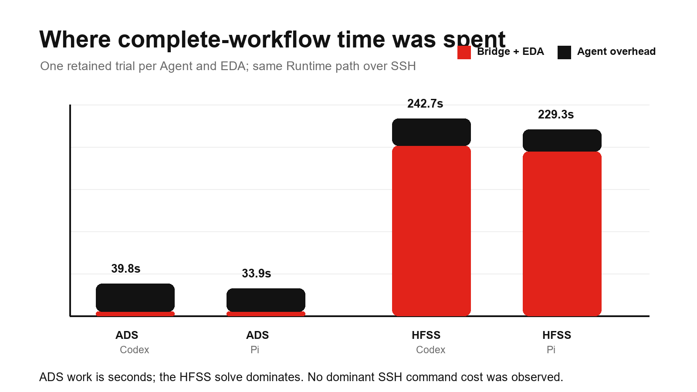
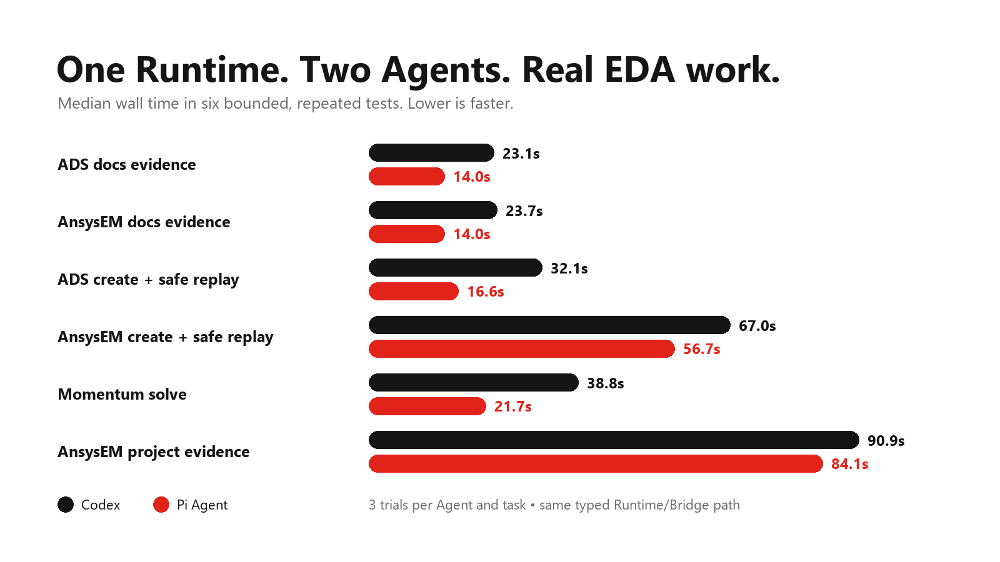

# EDA Bridge Runtime

<p align="center">
  
</p>

<p align="center"><strong>Ask naturally. Reach the right EDA. Keep the work recoverable and verifiable.</strong></p>

<p align="center">
  <a href="README.zh-CN.md">简体中文</a> ·
  <a href="https://pypi.org/project/eda-bridge-runtime/"></a>
  <a href="https://github.com/cottman99/eda-bridge-runtime/actions/workflows/ci.yml"></a>
  <a href="LICENSE"></a>
</p>



## One conversation can reach real, editable EDA results

Ask in normal engineering language. The vendor Bridge performs the ADS or AEDT
work while Runtime keeps the selected target, purpose, retry identity, long-job
receipt, timing, and evidence consistent across local and SSH execution.

| Editable ADS result | Editable HFSS result |
| --- | --- |
|  |  |

The retained public journeys built an ADS circuit, simulated 31 finite rows and
freshly reopened its native DDS page; and built a three-layer HFSS layout with
two ports, solved five frequencies and freshly reopened its native Report.
Codex and Pi each completed each journey with one recoverable Runtime plan.

| Model state you can inspect | The route that keeps it recoverable |
| --- | --- |
|  |  |

These are real application-window captures from public synthetic projects, not
mockups or Python replots. EDA Bridge Runtime is the shared, vendor-neutral path
behind the vendor Bridges: it preserves execution continuity and evidence while
ADS and AnsysEM Bridges retain their native engineering knowledge.

## What this changes for an engineer

| You want to… | Runtime makes sure… |
| --- | --- |
| Use normal language instead of assembling SSH commands | The selected local or remote connection is reused automatically. |
| Keep a long EDA task alive after a disconnect | The job is recorded before work starts and can be resumed by receipt. |
| Avoid repeating a mutation after a timeout or retry | The same request identity returns the existing run instead of blindly running again. |
| Know what happened and why | Each call records its concise purpose, observed Agent identity, phases, timing, result, and evidence links. |
| Switch between Codex and Pi Agent | Both use the same typed Runtime and vendor-Bridge contracts. |
| Work locally today and remotely tomorrow | Local and SSH routes follow the same protocol and safety rules. |

## What the public tests show



The newest acceptance cases are complete user journeys, not isolated API calls.
ADS started from an empty workspace, built and simulated a circuit, exported 31
finite rows, and freshly reopened an editable DDS page. HFSS 3D Layout started
from an empty project, built three layers and two ports, solved five frequencies,
and freshly reopened a native S-parameter report. Codex and Pi each completed
each journey with exactly one Runtime plan.

| Journey | Codex wall / Bridge + EDA | Pi wall / Bridge + EDA |
| --- | ---: | ---: |
| ADS circuit → data → DDS | 39.782 s / 5.438 s | 33.922 s / 5.140 s |
| HFSS layout → solve → report | 242.657 s / 209.360 s | 229.328 s / 202.641 s |

These are one retained functional trial per Agent and EDA, not statistical
speed claims. They show the useful boundary: the ADS engineering work took
seconds, while the HFSS solve dominated the long workflow. Packet-level network
time was not measured separately, but no dominant SSH command cost was observed.



The chart reports median wall time from six bounded public test cases, with
three trials per Agent and task. Both Agents used the same Runtime and Bridge
path. Agent-heavy tasks show the largest difference; AEDT-lifecycle-heavy work
is dominated by the EDA itself. This is an engineering baseline, not a universal
Agent ranking. See the [full method, pass rates, and interpretation boundary](evals/BASELINE_2026-08-30_CODEX_PI_SUMMARY.md).

The checked ladder covers documentation evidence, exact idempotent replay,
typed ADS and AnsysEM work, a real generated-input Momentum solve, and a
one-turn cross-EDA workflow. Sanitized acceptance evidence is maintained in
[Acceptance](docs/ACCEPTANCE.md).

## Start with one Agent profile

Install Runtime on the computer where the Agent runs:

```console
python -m pip install "eda-bridge-runtime==0.1.0a30"
eda-runtime doctor
```

Create the isolated profile for the Agent you use:

```console
eda-runtime agent-profile codex install
eda-runtime agent-profile pi install --help
```

The administrator selects vendor Skills and connection details once. Engineers
then start the generated profile and speak naturally; they do not maintain SSH
commands, metadata files, or Runtime logs by hand.

Install the matching vendor Bridge on each EDA host:

- [ADS Agent Bridge](https://github.com/cottman99/ads-agent-bridge)
- [AnsysEM Agent Bridge](https://github.com/cottman99/ansysem-agent-bridge)

If the Agent and EDA share one machine, register a local connection. If they are
separate, register SSH. Both still pass through Runtime so audit, retry, target,
and evidence behavior do not split into two systems.

## Safety promises

- Every Agent-originated action carries a concise purpose.
- Mutations require a stable identity and are never blindly replayed.
- A disconnect does not imply that a long EDA job failed.
- Context tokens contain locators and fingerprints, never credentials.
- The append-only ledger stores fingerprints and bounded metadata, not chat
  transcripts or raw operation payloads.
- Vendor-specific behavior stays in vendor Bridges, not in the Runtime core.
- Runtime does not claim a solve, artifact, or persisted change without
  corresponding Bridge evidence.

## Next

- add more vendor Bridges without changing the user's conversation pattern;
- make long-job recovery and evidence review easier to see;
- retain more complete, real engineering journeys across circuit, layout, EM,
  simulation, extraction, and native plotting.

## Learn more

- [How the pieces fit together](docs/ARCHITECTURE.md)
- [Agent host, EDA host, and combined deployment](docs/DEPLOYMENT_ROLES.md)
- [MCP and Codex integration](docs/MCP_AND_CODEX.md)
- [Pi Agent pilot](docs/PI_AGENT_PILOT.md)
- [Protocol schema](docs/schemas/request-v1.schema.json)
- [Current scope](docs/V0_1_SCOPE.md)

`eda-bridge-runtime` is public alpha software. Begin with disposable work and
review the vendor Bridge's capability and evidence boundary before using it on
important projects.
