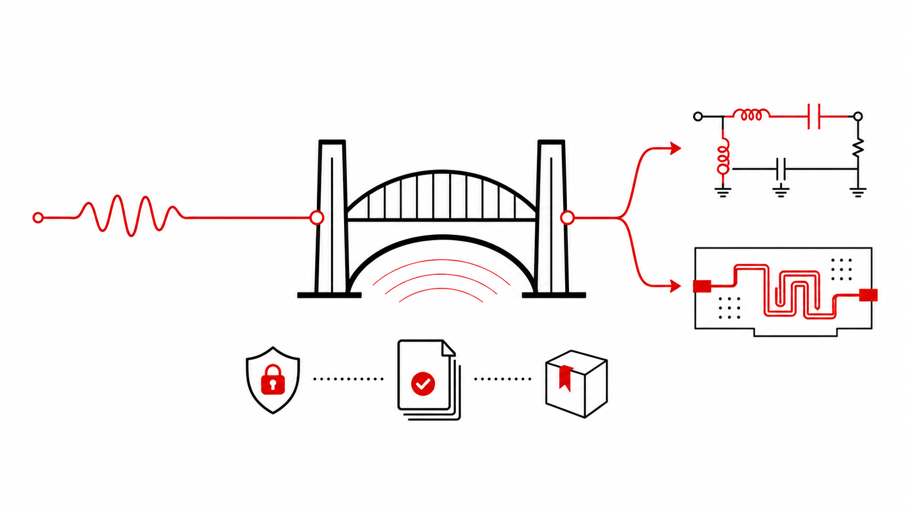

# EDA Bridge Runtime

<p align="center">
  
</p>

<p align="center"><strong>自然地提出任务，稳定地到达正确的 EDA，并留下可恢复、可验证的结果。</strong></p>

<p align="center">
  <a href="README.md">English</a>
</p>



EDA Bridge Runtime 是各类 EDA Agent Bridge 共用的、厂商无关的执行通道。
无论 Agent 与 EDA 在同一台电脑，还是通过 SSH 分处两台主机，用户看到的
目标选择、长任务恢复、耗时记录和证据规则都保持一致。

它不是新的 EDA 自动化 API，也不取代厂商 Bridge。ADS 与 AnsysEM Bridge
继续负责各自的软件知识；Runtime 负责让这些操作在不同 Agent、主机、
断线和长任务条件下仍然可预测。

## 它给工程师带来的变化

| 你想要…… | Runtime 负责保证…… |
| --- | --- |
| 只用自然语言，不自己拼 SSH 命令 | 自动复用已经选定的本机或远程连接。 |
| 断线后仍能继续长时间 EDA 任务 | 先记录任务再执行，之后可凭回执继续查看。 |
| 超时或重试时不重复修改工程 | 完全相同的请求返回原有运行结果，而不是盲目再执行。 |
| 知道系统做了什么、为什么做、花了多久 | 记录简短动机、可观察的 Agent 身份、阶段耗时、结果和证据引用。 |
| 在 Codex 与 Pi Agent 之间切换 | 两者使用相同的 Runtime 与厂商 Bridge 契约。 |
| 今天本机运行、明天改为远程运行 | 本机和 SSH 路径使用同一套协议和安全规则。 |

## 公开测试证明了什么


图中是六项公开受控测试的中位耗时，每个 Agent、每项任务重复三次。
两者都走相同 Runtime 与 Bridge。Agent 占比较高的任务差异更明显；
AEDT 生命周期占主导的任务主要受 EDA 本身耗时限制。这是工程基线，
不是对 Agent 的普遍排名。完整方法、通过率和解释边界见
[测试总结](evals/BASELINE_2026-08-30_CODEX_PI_SUMMARY.md)。

目前的测试阶梯覆盖文档证据、精确幂等重试、ADS 与 AnsysEM 的类型化
操作、真实 Momentum 求解，以及一次跨 EDA 协作。脱敏后的真实主机
验收记录见 [Acceptance](docs/ACCEPTANCE.md)。

最新的功能性验收已经从空白工程走到原生结果：ADS 搭建并仿真六元件
电路，再全新打开 DDS 曲线；AnsysEM 搭建三层双端口 HFSS 3D Layout，
求解 5 个频点，并全新打开原生 S 参数 Report。Codex 与 Pi 都只用了
一次 Runtime 调用完成各自闭环。这是单次功能验收，不是统计速度结论。

## 从一个 Agent 配置开始

在 Agent 所在的电脑安装 Runtime：

```console
python -m pip install "eda-bridge-runtime==0.1.0a28"
eda-runtime doctor
```

为你使用的 Agent 创建隔离配置：

```console
eda-runtime agent-profile codex install
eda-runtime agent-profile pi install --help
```

管理员只需一次性选择厂商 Skill 和连接。之后工程师启动生成的配置，
直接使用自然语言，不需要自己维护 SSH 命令、元信息文件或日志。

每台 EDA 主机安装对应的厂商 Bridge：

- [ADS Agent Bridge](https://github.com/cottman99/ads-agent-bridge)
- [AnsysEM Agent Bridge](https://github.com/cottman99/ansysem-agent-bridge)

Agent 与 EDA 同机时注册本机连接，分开时注册 SSH 连接。两种情况都经过
Runtime，因此审计、重试、目标选择和证据规则不会分裂成两套系统。

## 安全承诺

- 每个 Agent 操作都带一条简短动机。
- 修改操作必须有稳定身份，绝不盲目重复执行。
- SSH 断开不等于 EDA 长任务失败。
- Context 只包含定位信息和指纹，不包含凭据。
- 追加式日志保存指纹与受控元信息，不保存完整聊天或原始操作载荷。
- 厂商相关行为保留在各自 Bridge 中，不进入 Runtime 核心。
- 没有 Bridge 证据时，不宣称求解、产物或持久化修改成功。

## 进一步了解

- [整体架构](docs/ARCHITECTURE.md)
- [Agent 主机、EDA 主机与同机部署](docs/DEPLOYMENT_ROLES.md)
- [MCP 与 Codex 集成](docs/MCP_AND_CODEX.md)
- [Pi Agent 试点](docs/PI_AGENT_PILOT.md)
- [验收证据](docs/ACCEPTANCE.md)
- [当前范围](docs/V0_1_SCOPE.md)

本项目仍是公开 Alpha。首次使用请从可丢弃工程开始，并先查看相应厂商
Bridge 的能力边界和证据说明。
